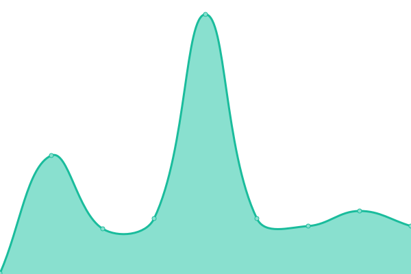
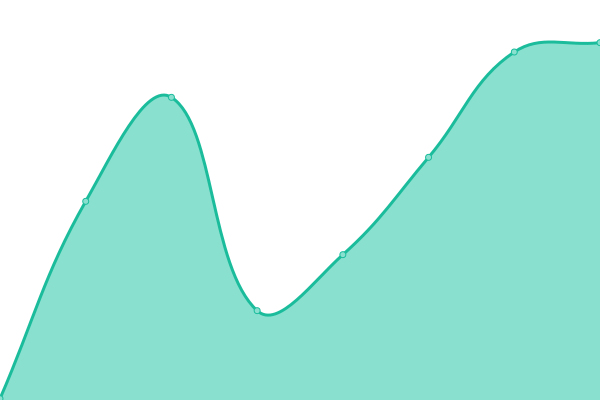
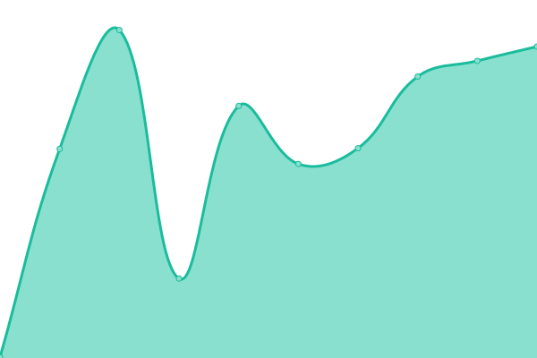
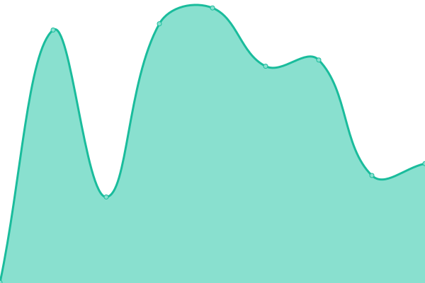
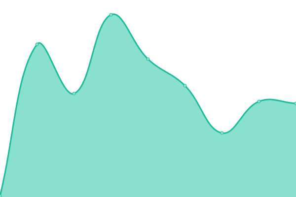

<!--start: status pages-->
<!-- This summary is generated by Upptime (https://github.com/upptime/upptime) -->
<!-- Do not edit this manually, your changes will be overwritten -->
<!-- prettier-ignore -->
| URL | Status | History | Response Time | Uptime |
| --- | ------ | ------- | ------------- | ------ |
|  [Google](https://www.google.com) | 🟩 Up | [google.yml](https://github.com/youngcaptains/upptime/commits/HEAD/history/google.yml) | 

 124ms
     
 | 

<a href="https://youngcaptains.github.io/upptime/history/google">100.00%</a>
    

|  [Wikipedia](https://en.wikipedia.org) | 🟩 Up | [wikipedia.yml](https://github.com/youngcaptains/upptime/commits/HEAD/history/wikipedia.yml) | 

 226ms
     
 | 

<a href="https://youngcaptains.github.io/upptime/history/wikipedia">100.00%</a>
    

|  [Hacker News](https://news.ycombinator.com) | 🟩 Up | [hacker-news.yml](https://github.com/youngcaptains/upptime/commits/HEAD/history/hacker-news.yml) | 

 336ms
     
 | 

<a href="https://youngcaptains.github.io/upptime/history/hacker-news">100.00%</a>
    

|  [Brawley 2](https://cruelajarevents.teambrawley.repl.co/) | 🟩 Up | [brawley-2.yml](https://github.com/youngcaptains/upptime/commits/HEAD/history/brawley-2.yml) | 

 1888ms
     
 | 

<a href="https://youngcaptains.github.io/upptime/history/brawley-2">100.00%</a>
    

|  [Music](https://music.youtube.com) | 🟩 Up | [music.yml](https://github.com/youngcaptains/upptime/commits/HEAD/history/music.yml) | 

 101ms
     
 | 

<a href="https://youngcaptains.github.io/upptime/history/music">100.00%</a>
    

<!--end: status pages-->
